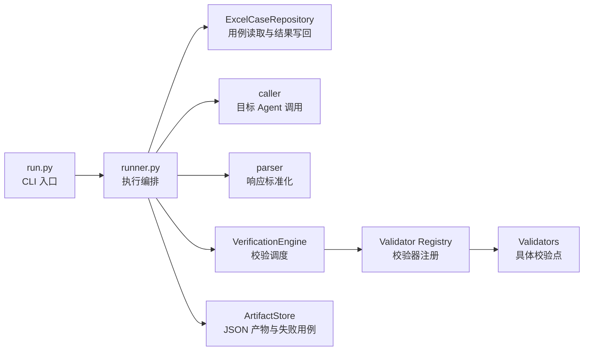
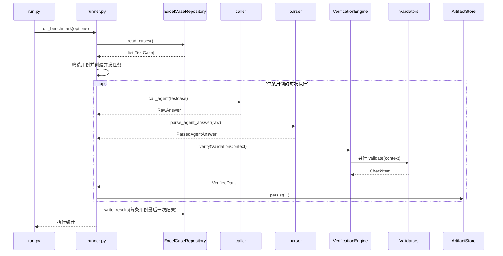

# Agent Bench 项目架构说明

## 1. 项目定位

Agent Bench 是一个面向 Agent API 的批量评测工具。它从 Excel 加载测试用例，调用目标 Agent，解析 Agent 返回的数据，通过多个独立校验器进行检查，最后将执行产物保存为 JSON，并把最后一次执行结果写回 Excel。

项目支持：

- 运行全部用例；
- 运行指定的一条或多条用例；
- 重跑 `outputs/fail/` 中的失败用例；
- 每条用例重复执行多次；
- 不同用例并发执行；
- 同一用例的多次执行串行进行；
- 动态扩展校验点；
- 分别保存成功、失败和异常产物。

## 2. 架构目标

当前架构围绕以下原则组织：

1. **单一职责**：调用、解析、校验、产物保存和 Excel 读写分别由独立模块负责。
2. **单向依赖**：执行层依赖业务模型和基础设施，具体校验器不反向依赖 runner。
3. **校验点可扩展**：新增校验点时，只新增 Validator 并注册，不修改执行器、Excel 或结果模型。
4. **结果模型稳定**：`VerifiedData` 使用动态 `checks` 保存校验项，不把具体校验点写死在模型中。
5. **失败隔离**：单个校验器异常不会阻断其他校验器；单条用例异常不会阻断其他用例。
6. **外部产物简单**：不引入数据库或复杂批次模型，使用 Excel 和 JSON 文件保存结果。

## 3. 总体架构



核心依赖方向为：

```text
run.py
  └── runner.py
        ├── caller/
        ├── parser/
        ├── verifier/
        │     └── validators/
        └── storage/

所有模块共同依赖：core/models.py
```

`core` 不依赖具体调用器、校验器和存储实现，因此可以作为稳定的公共层。

## 4. 项目目录

```text
agent-bench/
├── run.py                         # 命令行入口
├── runner.py                      # 批跑执行编排
├── config.yaml                    # Excel、目标 Agent 和 LLM 配置
├── pyproject.toml                 # Python 项目及依赖定义
├── uv.lock                        # uv 锁定依赖版本
├── inputs/
│   └── testcases.xlsx             # 测试用例及最终结果
├── caller/
│   ├── __init__.py
│   └── call_agent.py              # 目标 Agent HTTP 调用
├── core/
│   ├── __init__.py
│   ├── config.py                  # YAML 和环境变量配置加载
│   ├── models.py                  # 跨模块公共数据模型
│   ├── prompts.py                 # LLM 校验提示词
│   └── serializers.py             # LLM 响应文本提取
├── parser/
│   ├── __init__.py
│   └── agent_response.py          # Agent 原始响应标准化
├── storage/
│   ├── __init__.py
│   ├── artifacts.py               # JSON 产物和失败目录管理
│   └── excel.py                   # Excel 用例仓储
├── validators/
│   ├── __init__.py
│   ├── protocol.py                # Validator 统一协议
│   ├── registry.py                # 校验器显式注册表
│   ├── intent.py                  # 意图校验
│   ├── i18n.py                    # 中文输出合规校验
│   └── tool_choice.py             # 工具选择校验
└── verifier/
    ├── __init__.py
    ├── engine.py                  # 校验器并行调度和结果聚合
    └── factory.py                 # LLM 和校验器实例组装
```

## 5. 核心数据模型

所有跨模块传递的数据结构都定义在 `core/models.py`。

### 5.1 TestCase

表示一条测试用例：

```python
class TestCase(BaseModel):
    case_id: str
    question: str
    tools: list[str]
```

- `case_id`：用例唯一标识；
- `question`：发送给目标 Agent 的问题；
- `tools`：期望 Agent 使用的工具列表。

### 5.2 RawAnswer

保存目标 Agent 的原始响应：

```python
class RawAnswer(BaseModel):
    raw_data: dict
    extra_data: dict
```

- `raw_data` 保存 Agent API 返回的原始 JSON；
- `extra_data` 保存用例 ID、问题和期望工具等辅助信息。

### 5.3 ParsedAgentAnswer

表示 parser 从目标 Agent 响应中提取的标准结构：

```python
class ParsedAgentAnswer(BaseModel):
    intent_message: str
    reasoning_answers: list[dict]
    tool_calls_used: list
    tool_invoke_count: int
```

该模型只描述 Agent 实际返回了什么，不包含具体校验规则。期望工具仍然属于 `TestCase`，由工具校验器自行读取。

### 5.4 ValidationContext

所有校验器使用相同的稳定上下文：

```python
class ValidationContext(BaseModel):
    testcase: TestCase
    raw_answer: RawAnswer
    parsed: ParsedAgentAnswer
```

新增校验点时，可以从上下文选择需要的数据，不需要修改 VerificationEngine 的函数参数。

### 5.5 CheckStatus 和 CheckItem

所有失败状态统一使用 `FAILED`：

```python
class CheckStatus(StrEnum):
    PASS = "PASS"
    FAILED = "FAILED"
    ERROR = "ERROR"


class CheckItem(BaseModel):
    status: CheckStatus
    detail: str
```

含义如下：

- `PASS`：校验正常完成且符合规则；
- `FAILED`：校验正常完成，但结果不符合规则；
- `ERROR`：校验器自身发生异常，未能正常完成校验。

### 5.6 VerifiedData

完整校验结果使用动态字典保存：

```python
class VerifiedData(BaseModel):
    result: CheckStatus
    checks: dict[str, CheckItem]
```

示例：

```json
{
  "result": "FAILED",
  "checks": {
    "intent": {
      "status": "PASS",
      "detail": "意图: ASK"
    },
    "i18n": {
      "status": "PASS",
      "detail": "4 个字段全部中文合规"
    },
    "tool_choice": {
      "status": "FAILED",
      "detail": "期望工具未被调用: example-tool"
    }
  }
}
```

这种结构不会随校验点增加而改变模型字段。

## 6. 模块分工

### 6.1 run.py：命令行入口

`run.py` 只负责：

- 定义 CLI 参数；
- 校验正整数参数；
- 调用 `run_benchmark()`；
- 将用例选择错误转换为退出码 2。

支持的参数：

```text
--cases          指定一个或多个 case_id
--failed         重跑 outputs/fail 中的失败用例
--repeat         每条用例执行次数
--concurrency    并发执行的用例数
```

示例：

```powershell
# 全部用例执行一次
uv run python run.py

# 指定多条用例
uv run python run.py --cases case_001 case_003 case_008

# 逗号分隔也支持
uv run python run.py --cases case_001,case_003,case_008

# 每条用例执行三次，并发执行两条不同用例
uv run python run.py --repeat 3 --concurrency 2

# 重跑失败用例
uv run python run.py --failed
```

### 6.2 runner.py：执行编排

`runner.py` 是应用层协调器，不包含具体解析、校验或存储规则。

主要职责：

- 加载配置；
- 创建 Excel 和 Artifact 存储对象；
- 加载并筛选测试用例；
- 创建 VerificationEngine；
- 控制用例并发和重复执行；
- 串联调用、解析、校验和产物保存；
- 收集最后一次结果并批量写回 Excel；
- 统计 `PASS / FAILED / ERROR` 和通过率。

一次执行被划分为四个阶段：

```text
call → parse → verify → persist
```

如果阶段发生异常，错误产物会记录对应阶段名称。

### 6.3 caller：目标 Agent 调用

`caller/call_agent.py` 负责：

- 根据 TestCase 和目标 Agent 配置构造请求体；
- 发送 HTTP POST 请求；
- 设置请求超时；
- 对请求异常执行指数退避重试；
- 将返回 JSON 包装为 `RawAnswer`。

同步 `requests` 调用通过 `asyncio.to_thread()` 在线程中执行，不阻塞 runner 的事件循环。

### 6.4 parser：响应标准化

`parser/agent_response.py` 只负责结构解析，不执行任何校验。

它兼容以下两种目标 Agent 响应路径：

```text
data.curAnswer.outputs
data.curAnswer.content.outputs
```

parser 会提取：

- `reasoning_answers`；
- 第一条 reasoning 中的意图消息；
- 所有工具调用；
- 工具调用次数。

响应结构不完整时抛出 `ParserError`，由 runner 统一转换为 `ERROR`。

### 6.5 validators：具体校验点

每个校验点是一个独立模块，并实现 `Validator` 协议：

```python
class Validator(Protocol):
    name: str

    async def validate(
        self,
        context: ValidationContext,
    ) -> CheckItem:
        ...
```

当前校验器：

#### IntentValidator

- 使用 `INTENT_CHECK_PROMPT`；
- 调用共享 LLM 创建的 Agent；
- 判断 Agent 意图是否属于 ASK；
- 输出 `intent` 检查项。

#### I18nValidator

- 使用 `I18N_CHECK_PROMPT`；
- 合并所有 `text` 和 `reasoning` 字段进行批量检查；
- 一般只调用一次 LLM；
- LLM 未严格返回 `PASS/FAILED` 时最多重试一次；
- 输出 `i18n` 检查项。

#### ToolChoiceValidator

- 不调用 LLM；
- 校验工具调用次数是否超过 10；
- 校验期望工具是否都被调用；
- 输出 `tool_choice` 检查项。

### 6.6 validators/registry.py：校验器注册

所有启用的校验器通过显式注册表管理：

```python
VALIDATOR_TYPES = (
    IntentValidator,
    I18nValidator,
    ToolChoiceValidator,
)
```

显式注册可以清楚控制校验器集合和初始化顺序，也避免目录扫描带来的隐式加载问题。

### 6.7 verifier：校验调度

#### factory.py

负责：

- 根据 LLM 配置创建共享模型；
- 通过注册表实例化所有校验器；
- 创建 VerificationEngine。

#### engine.py

VerificationEngine 只负责通用调度：

1. 检查校验器名称是否重复；
2. 使用 `asyncio.gather()` 并行执行所有校验器；
3. 将单个校验器异常转换为该检查项的 `ERROR`；
4. 把结果收集为动态 `checks` 字典；
5. 计算整体状态。

整体状态优先级：

```text
存在 ERROR  → 整体 ERROR
否则存在 FAILED → 整体 FAILED
否则 → 整体 PASS
```

### 6.8 storage/artifacts.py：JSON 产物管理

ArtifactStore 负责：

- 创建 `outputs/` 和 `outputs/fail/`；
- 根据最终状态选择保存目录；
- 生成安全的 Windows 文件名；
- 原子写入 JSON；
- 从失败目录识别待重跑用例；
- 失败重跑前清空旧失败文件。

它不读取或写入 Excel。

### 6.9 storage/excel.py：Excel 用例仓储

ExcelCaseRepository 统一负责：

- 选择工作表；
- 识别两列或三列输入布局；
- 读取 TestCase；
- 根据 case_id 定位原始行；
- 写入最后一次状态；
- 在状态后一列写入 `VerifiedData` JSON；
- 为最终状态设置颜色。

将 Excel 读写放在同一个模块，可以避免 reader 和 writer 分别推测布局造成规则不一致。

## 7. 完整执行流程



### 7.1 单次执行

对于一条用例的第 N 次执行：

1. 日志打印 `[case_id #N] Call Agent...`；
2. Caller 调用目标 Agent；
3. Parser 将响应转换为 ParsedAgentAnswer；
4. Runner 构造 ValidationContext；
5. VerificationEngine 并行执行全部校验器；
6. 根据校验结果确定 `PASS / FAILED / ERROR`；
7. ArtifactStore 保存本次执行产物；
8. 返回状态、Excel 状态和 VerifiedData。

### 7.2 重复执行

`--repeat N` 表示每条用例执行 N 次。

- 同一用例的 N 次执行严格串行；
- 每次执行都有独立编号产物；
- 所有执行次数都计入最终统计；
- Excel 只写第 N 次，即最后一次执行结果。

例如：

```text
case_001_raw_1.json
case_001_verify_1.json
case_001_result_1.json
case_001_raw_2.json
case_001_verify_2.json
case_001_result_2.json
```

### 7.3 并发执行

`--concurrency N` 控制同时执行的不同用例数量。

Semaphore 包裹的是单条用例的完整重复执行过程，因此：

- 不同用例可以并发；
- 同一用例不会同时执行多个 attempt；
- ArtifactStore 使用线程锁保护并发文件写入；
- Excel 在所有用例执行完成后批量写入一次。

## 8. 状态与结果规则

### 8.1 状态定义

项目所有失败状态统一为：

```text
PASS
FAILED
ERROR
```

不使用 `FAIL`。

### 8.2 通过率

最终通过率按所有独立执行次数计算：

```text
PASS_RATE = PASS / (PASS + FAILED + ERROR)
```

示例：

```text
Completed! PASS=10, FAILED=20, ERROR=0, PASS_RATE=33.33%
```

## 9. JSON 产物规则

### 9.1 保存目录

```text
outputs/         PASS 产物
outputs/fail/    FAILED 和 ERROR 产物
```

### 9.2 文件命名

```text
{case_id}_raw_{attempt}.json
{case_id}_verify_{attempt}.json
{case_id}_result_{attempt}.json
{case_id}_error_{attempt}.json
```

各文件含义：

- `raw`：RawAnswer，目标 Agent 原始响应；
- `verify`：ParsedAgentAnswer，标准化后的待校验数据；
- `result`：VerifiedData，所有校验结果；
- `error`：调用、解析、校验调度或保存阶段的异常信息。

产物根据执行到达的阶段保存。例如调用阶段失败时，可能只有 `error` 文件；解析阶段失败时，通常会有 `raw` 和 `error` 文件。

### 9.3 原子写入

JSON 会先写入 `.tmp` 临时文件，再替换目标文件，避免进程中断后留下半个 JSON 文件。

## 10. 失败重跑流程

执行：

```powershell
uv run python run.py --failed
```

流程如下：

1. ArtifactStore 扫描 `outputs/fail/`；
2. 从 `*_result_N.json` 和 `*_error_N.json` 提取 case_id；
3. Runner 在 Excel 用例中查找这些 ID；
4. 所有 ID 确认有效后，清空 `outputs/fail/` 中的旧文件；
5. 只运行这些失败用例；
6. 本次仍然失败或异常的产物重新进入 `outputs/fail/`；
7. 本次通过的产物进入 `outputs/`。

因此失败目录在失败重跑后只保留本次重跑产生的失败结果。

## 11. Excel 格式

### 11.1 两列输入

```text
question | tools | 最终结果 | VerifiedData JSON
```

两列格式没有显式 case_id，系统根据原始行号生成：

```text
case_1
case_2
case_3
```

### 11.2 三列输入

```text
case_id | question | tools | 最终结果 | VerifiedData JSON
```

三列格式使用第一列的显式 case_id。

### 11.3 写回规则

- 每条用例只写最后一次执行结果；
- 最终状态写入输入列后的第一列；
- VerifiedData JSON 写入状态后一列；
- 最后一次为调用或解析异常时，VerifiedData 单元格留空；
- `PASS` 使用绿色样式；
- `FAILED` 使用红色样式；
- `ERROR` 使用灰色样式。

## 12. 异常处理

### 12.1 流水线异常

Runner 使用 `stage` 标记当前阶段：

```text
call
parse
verify
persist
```

发生异常时：

- 打印 `[case_id #N] ERROR (stage): ...`；
- 尽可能保存当前已经获得的 raw、verify 或 result；
- 生成 error JSON；
- 本次执行状态为 `ERROR`；
- 继续执行其他用例。

### 12.2 单个校验器异常

VerificationEngine 使用 `asyncio.gather(..., return_exceptions=True)` 隔离校验器异常。

某个 Validator 抛出异常时：

- 该检查项转换为 `CheckStatus.ERROR`；
- 异常类型和消息写入 detail；
- 其他校验器结果仍然保留；
- VerifiedData 整体状态为 `ERROR`。

## 13. 新增校验点

新增校验点不需要修改 runner、VerificationEngine、Excel 或 VerifiedData。

### 第一步：新增 Validator 文件

例如创建 `validators/response_quality.py`：

```python
from typing import Any

from core.models import CheckItem, CheckStatus, ValidationContext


class ResponseQualityValidator:
    name = "response_quality"

    @classmethod
    def create(cls, model: Any) -> "ResponseQualityValidator":
        """使用共享模型创建响应质量校验器。"""
        return cls(model)

    def __init__(self, model: Any):
        """保存响应质量校验所需的模型。"""
        self.model = model

    async def validate(self, context: ValidationContext) -> CheckItem:
        """校验 Agent 响应质量。"""
        # 从 context.testcase、context.raw_answer 或 context.parsed 读取数据
        passed = True
        detail = "响应质量符合要求"
        return CheckItem(
            status=CheckStatus.PASS if passed else CheckStatus.FAILED,
            detail=detail,
        )
```

如果校验器不使用 LLM，`create()` 可以忽略 model：

```python
@classmethod
def create(cls, model: Any) -> "ExampleValidator":
    """创建确定性校验器。"""
    return cls()
```

### 第二步：注册校验器

在 `validators/registry.py` 导入并注册：

```python
from validators.response_quality import ResponseQualityValidator


VALIDATOR_TYPES = (
    IntentValidator,
    I18nValidator,
    ToolChoiceValidator,
    ResponseQualityValidator,
)
```

### 第三步：验证结果

运行后，Excel 和 `*_result_N.json` 会自动出现新检查项：

```json
{
  "checks": {
    "response_quality": {
      "status": "PASS",
      "detail": "响应质量符合要求"
    }
  }
}
```

无需修改：

- `core/models.py`；
- `verifier/engine.py`；
- `runner.py`；
- `storage/excel.py`；
- `storage/artifacts.py`。

## 14. 校验点设计建议

新增校验点时建议遵循：

1. Validator 只负责一个清晰的校验目标；
2. 确定性规则优先使用代码，不调用 LLM；
3. 需要 LLM 的相关检查可在一个 Validator 内批量处理，避免调用次数线性增加；
4. 校验器只返回 CheckItem，不直接写文件或 Excel；
5. 校验器不修改 ValidationContext；
6. `name` 必须唯一，否则 VerificationEngine 会在启动时拒绝加载；
7. 业务不合规返回 `FAILED`，校验器自身不可用才返回或触发 `ERROR`；
8. 每个函数和方法都应保留说明职责的 docstring。

## 15. 配置模块

`core/config.py` 负责：

- 读取 `config.yaml`；
- 加载 `.env`；
- 替换 `${ENV_NAME}` 环境变量；
- 检查 `excel`、`target_agent` 和 `llm` 三个配置节点是否存在。

配置结构：

```yaml
excel:
  input_path: inputs/testcases.xlsx
  sheet_name: Sheet1

target_agent:
  base_url: http://127.0.0.1:8000
  api_path: /agent/chat
  username: ...
  password: ...
  ip: ...
  timeout_seconds: 180
  custom_param:
    config_name: ""
    model_name: ""

llm:
  provider: deepseek
  model: ...
  api_key: ...
  base_url: https://api.deepseek.com
```

## 16. 扩展边界

未来常见扩展对应的修改位置：

| 需求                       | 主要修改位置                                         |
| -------------------------- | ---------------------------------------------------- |
| 新增校验点                 | `validators/新文件.py`、`validators/registry.py` |
| 修改 LLM 提示词            | `core/prompts.py` 或对应 Validator                 |
| 兼容新的 Agent 响应结构    | `parser/agent_response.py`                         |
| 修改目标 Agent 请求协议    | `caller/call_agent.py`                             |
| 修改产物命名或失败目录规则 | `storage/artifacts.py`                             |
| 修改 Excel 输入或结果列    | `storage/excel.py`                                 |
| 修改批跑并发和重试策略     | `runner.py`                                        |
| 新增 CLI 参数              | `run.py`，必要时传递给 `runner.py`               |

通过上述边界，新功能可以集中在对应模块内完成，避免修改无关模块。
